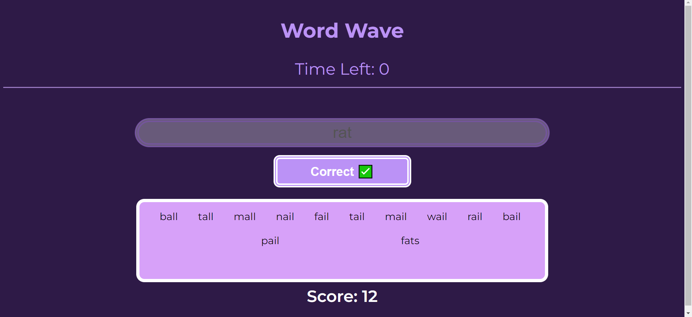

# Word Wave

This project was made as part of the Full Stack Development mini project submission.

### About the project

This is a simple word game which involves guessing as many 4 lettered words as possible within the given time limit of 30 seconds. The game adds all correct guessed words to an area below the input field and does not allow you to guess the same word again. Try to get the highest score you can.

### Features I want to add

- A result screen which shows the score you got and a highscore you've gotten (the result page is half made and so is the stylesheet for it 😅)
- Allow user to make customisation to the time limit
- Add a more challenging variation to guess words starting with / have a pre-determined random letter.
- Make website responsive to layouts

### Credits
Made with the help of Pranav Vinod Pillai who helped with the enable4.txt word list which gets all the 4 letter words to check your inputs with.

## You can access the site on this URL: https://cyl05.github.io/WordWave/
